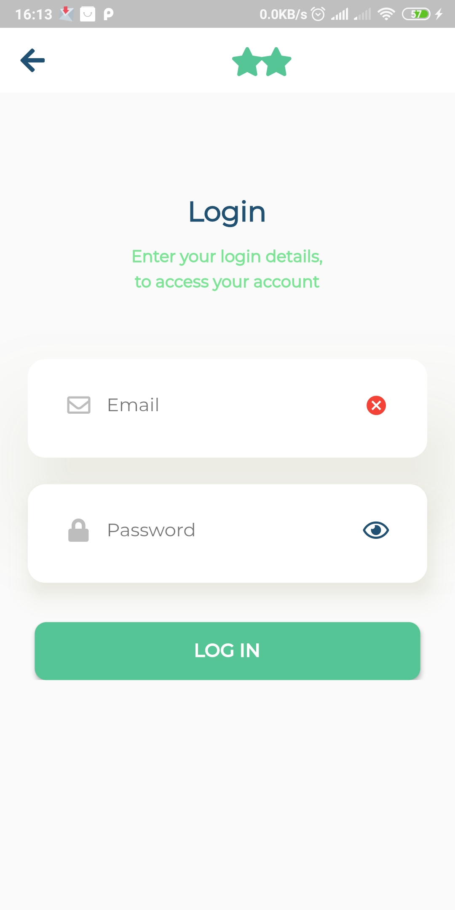
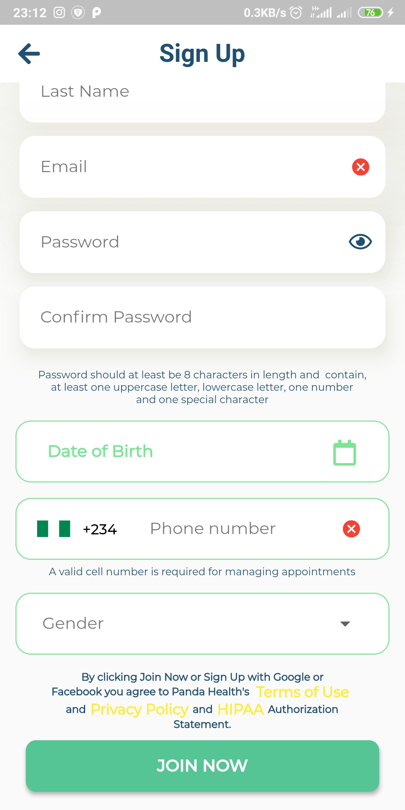

# panda health app

A new Flutter project.

## Getting Started

## Installation

to install dependecies.

```
flutter get
```

## Usage
To run the project on a connected device

```
flutter run
```

To build an app bundle

```
flutter build apk
```

To run tests (all tests files can be found in the test folder located in app's root directory)

```
flutter test path/to/test/file.dart
```

- To run integration test (Requires a physical device or an emulator)

```
- flutter drive --target=test_driver/app.dart
```


For help getting started with Flutter, view our
[online documentation](https://flutter.dev/docs), which offers tutorials,
samples, guidance on mobile development, and a full API reference.


###Screenshots
- 
- 
- 
- 

###App Build
[Download Apk](app.apk)